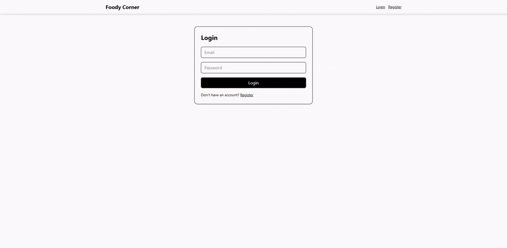

# Foody Corner

Full-stack recipe management app with cookie-based authentication, role-based access control, and Redux-powered frontend state.

## Tech Stack

- Frontend: React, Vite, Redux Toolkit, React Router, Axios, Tailwind CSS
- Backend: Node.js, Express, MongoDB (Mongoose), JWT, bcrypt, cookie-parser, cors

## Picture


## Video


## Features

- User registration and login
- Cookie-based session auth (`accessToken`, `refreshToken`)
- Session restore on refresh via `GET /api/auth/me`
- Role-based access:
  - `user`: can view own recipes, create, edit, delete own recipes
  - `admin`: can view all recipes and manage any recipe
- Recipe CRUD:
  - Create recipe
  - Edit recipe
  - Delete recipe
  - User-specific and admin-all listing

## Project Structure

```text
Foody-Corner/
  backend/
    src/
      controllers/
      middleware/
      models/
      routes/
      scripts/
  frontend/
    src/
      app/
      api/
      components/
      features/
      pages/
```

## Environment Variables

### Backend (`backend/.env`)

```env
PORT=3000
DB_URI=your_mongodb_connection_string
NODE_ENV=development

CORS_ORIGIN=http://localhost:5173

ACCESS_TOKEN=your_access_token_secret
ACCESS_TOKEN_EXPIRY=15m

REFRESH_TOKEN=your_refresh_token_secret
REFRESH_TOKEN_EXPIRY=7d

ADMIN_EMAIL=admin@example.com
ADMIN_NAME=Admin
ADMIN_PASSWORD=admin@123
```

### Frontend (`frontend/.env`)

```env
VITE_BACKEND_URL=http://localhost:3000/api
```

## Getting Started

### 1. Install Dependencies

```bash
cd backend && npm install
cd ../frontend && npm install
```

### 2. Seed Admin (optional, recommended)

```bash
cd backend
npm run seed
```

### 3. Run Backend

```bash
cd backend
npm run dev
```

### 4. Run Frontend

```bash
cd frontend
npm run dev
```

Open: `http://localhost:5173`

## API Overview

### Auth Routes

- `POST /api/auth/register`
- `POST /api/auth/login`
- `POST /api/auth/logout` (protected)
- `GET /api/auth/me` (protected)

### Recipe Routes

- `GET /api/receipe/receipes` (protected, current user recipes)
- `GET /api/receipe/receipes/admin` (protected, admin only)
- `POST /api/receipe/` (protected)
- `PUT /api/receipe/:id` (protected, owner/admin)
- `DELETE /api/receipe/:id` (protected, owner/admin)

## Scripts

### Backend

- `npm run dev` - run backend in watch mode
- `npm run start` - run backend
- `npm run seed` - seed/promote admin user

### Frontend

- `npm run dev` - start Vite dev server
- `npm run build` - production build
- `npm run preview` - preview built app

## Notes

- This project currently uses the path name `receipe` across backend routes/models for consistency with existing code.
- If auth fails with generic network errors, verify:
  - `VITE_BACKEND_URL` is correct
  - backend is running on `PORT`
  - `CORS_ORIGIN` matches frontend origin
